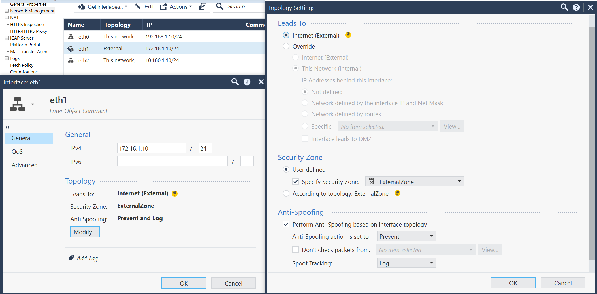

# Сегментация облачной инфраструктуры на зоны безопасности с помощью решения Check Point Next-Generation Firewall 

## Содержание
- [Описание решения](#описание-решения)
- [Архитектура решения и основные компоненты](#архитектура-решения-и-основные-компоненты)
- [Разворачиваемые сегменты и ресурсы](#разворачиваемые-сегменты-и-ресурсы)
- [Действия по развертыванию сценария ](#действия-по-развертыванию-сценария)
- [Подготовьте облако к работе](#подготовьте-облако-к-работе)
- [Подготовьте окружение](#подготовьте-окружение)
- [Разверните ресурсы](#разверните-ресурсы)
- [Настройте NGFW](#настройте-ngfw)
- [Проверка работоспособности](#протестируйте-работоспособность-решения)
- [Требования к развертыванию в продуктивной среде](#требования-к-развертыванию-в-продуктивной-среде)
- [Удаление созданных ресурсов](#как-удалить-созданные-ресурсы)


## Описание решения

Сценарий разворачивает в Yandex Cloud облачную инфраструктуру для решения задач:
- защиты и сегментации инфраструктуры на зоны безопасности
- публикации приложений в интернет из зоны [DMZ](https://ru.wikipedia.org/wiki/DMZ_(компьютерные_сети))

Каждый сегмент сети (далее сегмент) содержит ресурсы одного назначения, обособленные от других ресурсов. Например, DMZ сегмент предназначен для размещения общедоступных приложений (обычно Frontend веб-сервера), а сегмент mgmt содержит ресурсы, используемые для управления облачной сетевой инфраструктурой. В облаке каждому сегменту соответствует свой каталог и своя облачная сеть VPC. Связь между сегментами происходит через виртуальную машину Check Point Next-Generation Firewall (NGFW), обеспечивающую комплексную защиту сегментов и контроль трафика между сегментами. 

Если необходимо обеспечить отказоустойчивость NGFW и высокую доступность развернутых приложений, то используйте [рекомендуемое решение](https://cloud.yandex.ru/docs/tutorials/routing/high-accessible-dmz).


## Архитектура решения и основные компоненты


Описание элементов схемы:

| Название элемента | Описание | Комментарии |
| ----------- | ----------- | ----------- | 
| VPC: public-vpc | Сегмент сети public | Для организации публичного доступа из интернет | 
| VPC: mgmt-vpc | Сегмент сети mgmt | Для управления облачной инфраструктурой и размещения служебных ресурсов | 
| VPC: dmz-vpc | Сегмент сети DMZ | Для размещения Frontend приложений, доступных из интернет | 
| FW | Виртуальная машина Check Point NGFW | Для защиты инфраструктуры и сегментации сети на зоны безопасности |
| mgmt, public, dmz | Интерфейсы ВМ Check Point NGFW | Каждый интерфейс подключен в соответствующий VPC |
| Jump ВМ | Виртуальная машина c настроенным [WireGuard VPN](https://www.wireguard.com/) | Для защищенного VPN подключения к сегменту управления |
| Сервер управления FW | Виртуальная машина c ПО Check Point Security Management | Для централизованного управления решением Check Point |
| Приложение | ВМ с веб-сервером Nginx | Пример тестового приложения, развернутого в DMZ сегменте |

</details>

### Next-Generation Firewall

В [Yandex Cloud Marketplace](https://cloud.yandex.ru/marketplace?categories=security) доступно несколько вариантов NGFW. В данном сценарии используется решение [Check Point CloudGuard IaaS](https://cloud.yandex.ru/marketplace/products/checkpoint/cloudguard-iaas-firewall-tp-payg-m), предоставляющее следующие возможности:
- Межсетевой экран, NAT, предотвращение вторжений, антивирус и защита от ботов
- Гранулярный контроль трафик на уровне приложений, логирование сессий
- Централизованное управление с помощью решения Check Point Security Management
- Решение Check Point в данном примере настроено с базовыми политиками доступа (Access Control) и NAT

Решение Check Point CloudGuard IaaS доступно в Yandex Cloud Marketplace в вариантах Pay as you go и BYOL. В этом примере используется BYOL вариант с Trial периодом 15 дней:
- ВМ NGFW [Check Point CloudGuard IaaS - Firewall & Threat Prevention BYOL](https://cloud.yandex.ru/marketplace/products/checkpoint/cloudguard-iaas-firewall-tp-byol-m)
- ВМ сервера управления [Check Point CloudGuard IaaS - Security Management BYOL](https://cloud.yandex.ru/marketplace/products/checkpoint/cloudguard-iaas-security-management-byol-m) для задач управления NGFW

Для использования в продуктивной среде рекомендуется рассматривать варианты:
- NGFW [Check Point CloudGuard IaaS - Firewall & Threat Prevention PAYG](https://cloud.yandex.ru/marketplace/products/checkpoint/cloudguard-iaas-firewall-tp-payg-m)
- Для сервера управления Check Point CloudGuard IaaS - Security Management необходимо приобрести отдельную лицензию либо использовать свою on-prem инсталляцию сервера управления


### Группы безопасности

Для контроля трафика между ресурсами внутри сегмента используются [группы безопасности](https://cloud.yandex.ru/docs/vpc/concepts/security-groups).


## Разворачиваемые сегменты и ресурсы

Решение создает в облаке ресурсы для 3 сегментов 

| Сегмент | Описание | Ресурсы | Каталоги и сети | Группы безопасности | 
| ----------- | ----------- | ----------- | ----------- | ----------- |
| public | Размещение ресурсов с доступом из интернет | | + | + |
| mgmt | Управление облачной инфраструктурой | Check Point NGFW, сервер управления Check Point, Jump ВМ с WireGuard для подключения из интернет | + | + |
| dmz | Размещение Frontend приложений, доступных из интернет | Виртуальная машина с веб-сервером Nginx для примера | + | + |

> **Важно**
> 
> Если в будущем ожидается увеличение количества сегментов, то рекомендуется развернуть их заранее, т.к. ВМ с образом NGFW в облаке не поддерживает добавление новых сетевых интерфейсов после её создания. Дополнительные сегменты можно указать в файле `terraform.tfvars`.

## Действия по развертыванию сценария 

Чтобы развернуть защищенную сетевую инфраструктуру на основе Check Point Next-Generation Firewall:

1. [Подготовьте облако к работе](#подготовьте-облако-к-работе)
1. [Подготовьте окружение](#подготовьте-окружение)
1. [Разверните ресурсы](#разверните-ресурсы)
1. [Настройте NGFW](#настройте-ngfw)
1. [Протестируйте работоспособность решения](#протестируйте-работоспособность-решения)

Если созданные ресурсы вам больше не нужны, [удалите их](#как-удалить-созданные-ресурсы).

> **Важно**
> 
> Без шагов настройки NGFW проверить работоспособность решения не получится.
 

## Подготовьте облако к работе

Зарегистрируйтесь в Yandex Cloud и создайте платежный аккаунт:

1. Перейдите в [консоль управления](https://console.cloud.yandex.ru/), затем войдите в Yandex Cloud или зарегистрируйтесь.
1. На странице [Биллинг](https://console.cloud.yandex.ru/billing) убедитесь, что у вас подключен платежный аккаунт, и он находится в статусе `ACTIVE` или `TRIAL_ACTIVE`. Если платежного аккаунта нет, [создайте его](https://cloud.yandex.ru/docs/billing/quickstart/).
Если у вас есть активный платежный аккаунт, вы можете создать или выбрать каталог, в котором будет работать ваша инфраструктура, на [странице облака](https://console.cloud.yandex.ru/cloud).
1. Проверьте наличие учетной записи в облаке с правами admin на облако.


### Необходимые платные ресурсы

В стоимость поддержки инфраструктуры входит:

* плата за постоянно работающие ВМ (см. [тарифы Yandex Compute Cloud](https://cloud.yandex.ru/docs/compute/pricing));
* плата за использование публичных IP-адресов и исходящий трафик (см. [тарифы Yandex Virtual Private Cloud](https://cloud.yandex.ru/docs/vpc/pricing));


### Необходимые квоты

Убедитесь, что в облаке достаточно [квот](https://cloud.yandex.ru/docs/overview/concepts/quotas-limits) и они не заняты ресурсами для других задач.

<details>
<summary>Посмотреть справочную информацию по количеству ресурсов, создаваемых в сценарии</summary>

| Ресурс | Количество |
| ----------- | ----------- |
| Каталоги | 3 |
| Виртуальные машины | 4 |
| vCPU виртуальных машин | 12 |
| RAM виртуальных машин | 20 ГБ |
| Диски | 4 |
| Объем SSD дисков | 240 ГБ |
| Объем HDD дисков | 20 ГБ |
| Облачные сети | 3 |
| Подсети | 3 |
| Таблицы маршрутизации | 2 |
| Группы безопасности | 5 |
| Статические публичные IP-адреса | 2 |
| Статические маршруты | 3 |

</details>

## Подготовьте окружение

В руководстве используется программное обеспечение для ОС Windows и подсистема [Windows Subsystem for Linux](https://ru.wikipedia.org/wiki/Windows_Subsystem_for_Linux).
Инфраструктура разворачивается с помощью [ Terraform](https://www.terraform.io/). 

1. Если WSL не установлена, [установите](https://learn.microsoft.com/en-us/windows/wsl/install) ее.
1. Дополнительно можно установить на подсистему WSL привычный вам дистрибутив ОС Linux, например, [Ubuntu](https://ubuntu.com/tutorials/install-ubuntu-on-wsl2-on-windows-11-with-gui-support#1-overview).


> **Важно**
> 
> Все описанные далее действия в терминале выполняются в ОС Linux.

1. [Установите Git](https://github.com/git-guides/install-git)
1. [Установите Terraform](https://cloud.yandex.ru/docs/tutorials/infrastructure-management/terraform-quickstart#install-terraform)
1. [Установите и настройте Yandex Cloud CLI](https://cloud.yandex.ru/docs/cli/quickstart)


## Разверните ресурсы

1. Склонируйте репозиторий `yandex-cloud-examples/yc-checkpoint` из GitHub и перейдите в папку сценария `yc-checkpoint`:
    
    ```bash
    git clone https://github.com/yandex-cloud-examples/yc-checkpoint
    cd yc-checkpoint
    ```

1. Настройте профиль CLI для выполнения операций от имени сервисного аккаунта ([подробности](https://cloud.yandex.ru/docs/tutorials/infrastructure-management/terraform-quickstart#get-credentials)).
    
1. Добавьте аутентификационные данные в переменную окружения:
    ```bash
    export YC_TOKEN=$(yc iam create-token)
    ```

1. Получите публичный IP-адрес вашего ПК:
      
      ```bash
      curl ifconfig.io
      ```

1. Заполните файл `terraform.tfvars` вашими значениями переменных. Файл содержит примеры значений, но вы можете заменить их своими данными (идентификатор облака, название сегментов и IP адреса подсетей, порт приложения в dmz, параметры для подключения к Jump ВМ). Обязательно укажите идентификатор вашего облака `cloud_id` и список публичных IP адресов/подсетей `trusted_ip_for_access_jump-vm`, с которых разрешено подключение к Jump ВМ. Откройте файл `terraform.tfvars` и отредактируйте:

   1. Строку, содержащую идентификатор облака:
      
      ```text
      cloud_id = "<идентификатор_облака>"
      ```

   1. Строку, содержащую список разрешенных публичных IP-адресов для доступа к ВМ `jump-vm`:
      
      ```text
      trusted_ip_for_access_jump-vm = ["<внешний_IP_ПК>/32"]
      ```

    > **Важно**
    > 
    > Рекомендуется заранее указать дополнительные сегменты, если они могут потребоваться в будущем, т.к. ВМ с образом NGFW в облаке не поддерживает добавление новых сетевых интерфейсов после её создания. 

    <details>
    <summary>Посмотреть описание переменных в terraform.tfvars</summary>

    | Название<br>параметра | Нужно<br>изменение | Описание | Тип | Пример |
    | ----------- | ----------- | ----------- | ----------- | ----------- |
    | `cloud_id` | да | Идентификатор вашего облака в Yandex Cloud | `string` | `b1g8dn6s3v2eiid9dbci` |
    | `az_name` | - | <a href="https://cloud.yandex.ru/docs/overview/concepts/geo-scope">Зона доступности</a> Yandex Cloud для размещения ресурсов | `string` | `ru-central1-d` |
    | `security_segment_names` | - | Список названий сегментов. Первый сегмент для размещения ресурсов управления, второй с публичным доступом в интернет, третий для DMZ. Если требуются дополнительные сегменты, то нужно добавлять их в конец списка. При добавлении сегмента обязательно добавьте префикс для подсети в список `subnet_prefix_list`. | `list(string)` |  `["mgmt", "public", "dmz"]` |
    | `subnet_prefix_list` | - | Список сетевых префиксов для подсетей, соответствующих списку названия сегментов `security_segment_names`. По одному префиксу для сегмента. | `list(string)` | `["192.168.1.0/24", "172.16.1.0/24", "10.160.1.0/24"]` |
    | `public_app_port` | - | TCP порт для опубликованного в DMZ приложения для подключения из интернет | `number` | `80` |
    | `internal_app_port` | - | Внутренний TCP порт опубликованного в DMZ приложения, на который NGFW будет направлять трафик. Может отличаться от public_app_port или совпадать с ним. | `number` | `8080` |
    | `trusted_ip_for_access_jump-vm` | да | Список публичных IP адресов/подсетей, с которых разрешено подключение к Jump ВМ. Используется во входящем правиле группы безопасности для Jump ВМ. | `list(string)` | `["A.A.A.A/32", "B.B.B.0/24"]` |
    | `jump_vm_admin_username` | - | Имя пользователя для подключения к Jump ВМ по SSH | `string` | `admin` |
    | `wg_port` | - | UDP порт для входящих соединений в настройках WireGuard на Jump ВМ | `number` | `51820` |

    </details>


1. Разверните ресурсы в облаке с помощью Terraform:

   1. Выполните инициализацию Terraform:
       
       ```bash
       terraform init
       ```

   1. Проверьте конфигурацию Terraform файлов:
       
       ```bash
       terraform validate
       ```

   1. Проверьте список создаваемых облачных ресурсов:
       
       ```bash
       terraform plan
       ```

   1. Создайте ресурсы:
       
       ```bash
       terraform apply
       ```
1. После завершения процесса `terraform apply` в командной строке будет выведен список информации о развернутых ресурсах. В дальнейшем его можно будет посмотреть с помощью команды `terraform output`:

    <details>
    <summary>Посмотреть информацию о развернутых ресурсах</summary>

    | Название | Описание | Пример значения |
    | ----------- | ----------- | ----------- |
    | `dmz-web-server_ip_address` | IP адрес веб-сервера в сегменте dmz для тестирования публикации приложения из dmz. Используется для настройки Destination NAT в FW. | `10.160.1.100` |
    | `fw-mgmt-server_ip_address` | IP адрес сервера управления FW | `192.168.1.100` |
    | `fw_gaia_portal_mgmt-server_password` | Пароль по умолчанию для первоначального подключения по https к IP адресу сервера управления FW | `admin` |
    | `fw_mgmt_ip_address` | IP адрес FW в сети управления | `192.168.1.10` |
    | `fw_public_ip_address` | Публичный IP адрес для FW | `D.D.D.D` |
    | `fw_sic-password` | Однократный пароль (SIC) для добавления FW в сервер управления FW | Не показывается в общем выводе `terraform output`. Для отображения значения используйте `terraform output fw_sic-password`. |
    | `fw_smartconsole_mgmt-server_password` | Пароль для подключения к серверу управления FW с помощью графического приложения Check Point SmartConsole | Не показывается в общем выводе `terraform output`. Для отображения значения используйте `terraform output fw_smartconsole_mgmt-server_password`. |
    | `jump-vm_path_for_WireGuard_client_config` | Файл конфигурации для защищенного VPN подключения с помощью клиента WireGuard к Jump ВМ | `./jump-vm-wg.conf` |
    | `jump-vm_public_ip_address_jump-vm` | Публичный IP адрес Jump ВМ | `E.E.E.E` |
    | `path_for_private_ssh_key` | Файл с private ключом для подключения по протоколу SSH к ВМ (jump-vm, fw, mgmt-server, веб-сервер в сегменте dmz) | `./pt_key.pem` |
    
    </details>

## Настройте NGFW

Вы можете настроить FW под ваши задачи в соответствие с корпоративной политикой безопасности. Для управления и настройки решения Check Point используется графическое приложение SmartConsole, доступное для операционной системы Windows. 

В качестве примера приводятся шаги настройки FW с базовыми политиками доступа (Access Control) и NAT, необходимыми для проверки работоспособности, но не являющимися достаточными для развертывания инфраструктуры в продуктивной среде.

Шаги настройки NGFW в этом сценарии состоят из следующей последовательности действий, выполняемых в SmartConsole:
- Добавление FW
- Настройка сетевых интерфейсов FW
- Создание сетевых объектов 
- Настройка политик доступа (Access Control - Policy)
- Настройка политик NAT трансляций (Access Control - NAT)
- Применение политик безопасности

Подробнее с возможностями Check Point и его настройкой можно познакомиться в бесплатном курсе [Погружение в сетевую безопасность](https://cloud.yandex.ru/training/network-security).

### Подключитесь к сегменту управления через VPN

После развертывания инфраструктуры в каталоге `mgmt` появится ВМ `jump-vm` на основе образа Ubuntu с настроенным [WireGuard VPN](https://www.wireguard.com/) для защищенного подключения. Настройте VPN туннель к ВМ `jump-vm` на вашем ПК для доступа к подсетям сегментов `mgmt`, `dmz`, `public`.  

Чтобы настроить VPN туннель:

1. Получите имя пользователя в подсистеме Linux:

   ```bash
   whoami
   ```

1. [Установите](https://download.wireguard.com/windows-client/wireguard-installer.exe) на ваш ПК приложение WireGuard.
1. Откройте приложение WireGuard и нажмите кнопку **Add Tunnel**.
1. В появившемся диалоге выберите файл `jump-vm-wg.conf` в папке `yc-checkpoint`.
   Чтобы найти папку, созданную в подсистеме Linux, например, Ubuntu, введите в адресной строке диалога путь к файлу:

   ```bash
   \\wsl$\Ubuntu\home\<имя_пользователя_Ubuntu>\yc-checkpoint
   ```
   
   Где `<имя_пользователя_Ubuntu>` — имя пользователя текущего дистрибутива ОС Linux.

1. Активируйте туннель нажатием на кнопку **Activate**.
1. Проверьте сетевую связность с сервером управления через VPN туннель WireGuard, выполнив в терминале команду:
   
   ```bash
   ping 192.168.1.100
   ```

   > **Важно**
   > 
   > Если пакеты не достигают сервера управления, проверьте, что в [группе безопасности](https://cloud.yandex.ru/docs/vpc/concepts/security-groups) `mgmt-jump-vm-sg` в правилах входящего трафика прописан верный публичный IP-адрес ПК.


### Запустите консоль управления SmartConsole

Для управления и настройки решения Check Point установите и запустите графическое приложение SmartConsole: 

1. Подключитесь к серверу управления NGFW, перейдя в браузере по адресу https://192.168.1.100. 
1. Авторизируйтесь используя логин `admin` и пароль `admin`. 
1. В открывшемся интерфейсе Gaia Portal скачайте графическое приложение SmartConsole. Для этого нажмите **Manage Software Blades using SmartConsole. Download Now!**.
1. Установите приложение SmartConsole на ПК.
1. Получите пароль доступа к SmartConsole:
   
    ```bash
    terraform output fw_smartconsole_mgmt-server_password
    ```

1. Откройте SmartConsole и авторизируйтесь, указав логин `admin`, IP-адрес сервера управления `192.168.1.100` и пароль доступа к SmartConsole.

### Добавьте FW

Добавьте FW в сервер управления, используя Wizard:

1. Слева сверху в выпадающем списке **Objects** выберите **More object types → Network Object → Gateways and Servers → New Gateway...**.
1. Нажмите **Wizard Mode**.
1. В открывшемся диалоге введите:
   * **Gateway name:** `FW`
   * **Gateway platform:** `CloudGuard IaaS`
   * **IPv4:** `192.168.1.10`
1. Нажмите **Next**.
1. Получите пароль доступа к FW:
   
    ```bash
    terraform output fw_sic-password
    ```

1. В поле **One-time password** введите пароль, полученный ранее.
1. Нажмите **Next** и **Finish**.

### Настройте сетевые интерфейсы шлюза FW

Настройте сетевой интерфейс `eth0`:

1. На вкладке **Gateways & Servers** откройте диалог настроек FW. Для этого в списке кликните дважды на добавленный FW.
1. На вкладке **Network Management** в таблице **Topology** выберите интерфейс `eth0`, нажмите **Edit** и в появившемся окне нажмите **Modify...**.
1. В разделе **Security Zone** активируйте **Specify Security Zone** и выберите **InternalZone**.

Аналогично настройте сетевые интерфейсы `eth1`, `eth2`:

1. Для интерфейса `eth1` укажите в разделе **Security Zone** зону **ExternalZone**.
1. Для интерфейса `eth2` в разделе **Leads To** выберите **Override** и активируйте **Interface leads to DMZ**. В разделе **Security Zone** укажите зону **DMZZone**.

| Interface | IPv4 address/mask | Leads To | Security Zone | Anti Spoofing |
| ----------- | ----------- | ----------- | ----------- | ----------- |
| eth0 | 192.168.1.10/24 | This network (Internal) | InternalZone | Prevent and Log |
| eth1 | 172.16.1.10/24 | Internet (External) | ExternalZone | Prevent and Log |
| eth2 | 10.160.1.10/24 | This network, DMZ (Internal) | DMZZone | Prevent and Log |

<details>
<summary>Настройка интерфейсов для FW</summary>


<details>
<summary>Настройка mgmt интерфейса FW</summary>


</details>

<details>
<summary>Настройка public интерфейса FW</summary>



</details>

<details>
<summary>Настройка dmz интерфейса FW</summary>


</details>
</details> 


### Создайте сетевые объекты

1. Слева сверху в выпадающем списке **Objects** выберите **New Network...** и создайте сети со следующими данными:

    | Name | Network address | Net mask |
    | ----------- | ----------- | ----------- |
    | mgmt | 192.168.1.0 | 255.255.255.0 |
    | public | 172.16.1.0 | 255.255.255.0 |
    | dmz | 10.160.1.0 | 255.255.255.0 |

    <details>
    <summary>Пример скриншота для public</summary>

    

    </details>

    Для сети dmz настройте Automatic Hide NAT, чтобы скрыть адреса ВМ, которые находятся в DMZ сегменте и выходят в интернет, за IP адресом FW в сегменте public. Для этого:
      1. В диалоге редактирования сети `dmz` перейдите на вкладку **NAT**.
      1. Активируйте **Add automatic address translation rules**, выберите **Hide** из выпадающего списка и опцию **Hide behind gateway**.

    <details>
    <summary>Настройка NAT для dmz сети</summary>

    

    </details>


1. Слева сверху в выпадающем списке **Objects** выберите **New Host...** и создайте хосты со следующими данными:

    | Name | IPv4 address |
    | ----------- | ----------- |
    | dmz-web-server | 10.160.1.100 |
    | FW-public-IP | 172.16.1.10 |

    <details>
    <summary>Пример скриншота для dmz-web-server</summary>

    

    </details>

1. Выберите **More object types → Network Object → Service → New TCP...** и создайте TCP-сервис для развернутого приложения в DMZ-сегменте, указав имя `TCP_8080` и порт `8080`.

    <details>
    <summary>Скриншот TCP Service</summary>

    

    </details>

### Определите правила политики безопасности

Чтобы добавить правило безопасности:

1. На вкладке **Security policies** в разделе **Access Control** выберите подраздел **Policy**.
1. В таблице правил нажмите правую кнопку мыши и напротив опции **New Rule** контекстного меню выберите **Above** или **Below**.
1. В новой строке:
   * в колонке **Name** впишите `Web-server port forwarding on FW`;
   * в колонке **Destination** выберите объект `FW-public-IP`;
   * в колонке **Services & Applications** выберите объект `http`;
   * в колонке **Action** выберите опцию `Accept`;
   * в колонке **Track** выберите опцию `Log`.


Аналогично внесите остальные правила из ниже приведенной таблицы базовых правил для проверки работы политик FW, публикации тестового приложения из DMZ сегмента и тестирования отказоустойчивости.

| No | Name | Source | Destination | VPN | Services & Applications | Action | Track | Install On |
| ----------- | ----------- | ----------- | ----------- | ----------- | ----------- | ----------- | ----------- | ----------- |
| 1 | Web-server port forwarding on FW | Any | FW-public-IP | Any | http | Accept | Log | Policy Targets (All gateways) |
| 2 | FW management | mgmt | FW, mgmt-server | Any | https, ssh | Accept | Log | Policy Targets (All gateways)  |
| 3 | Stealth | Any | FW, mgmt-server | Any | Any | Drop | Log | Policy Targets (All gateways) |
| 4 | mgmt to DMZ | mgmt | dmz | Any | Any | Accept | Log | Policy Targets (All gateways) |
| 5 | mgmt to public | mgmt | public | Any | Any | Accept | Log | Policy Targets (All gateways) |
| 6 | ping from dmz to internet | dmz | ExternalZone | Any | icmp-reguests (Group) | Accept | Log | Policy Targets (All gateways) |
| 7 | Cleanup rule | Any | Any | Any | Any | Drop | Log | Policy Targets (All gateways) |

<details>
<summary>Описание правил политики доступа Access Control - Policy</summary>

| Номер | Имя | Описание |
| ----------- | ----------- | ----------- |
| 1 | Web-server port forwarding on FW | Разрешение доступа из интернет к IP адресу FW в public сегменте по порту TCP 80 | 
| 2 | FW management | Разрешение доступа к FW, серверу управления FW из mgmt сегмента для задач управления |
| 3 | Stealth | Запрет доступа к FW, серверу управления FW из других сегментов |
| 4 | mgmt to DMZ | Разрешение доступа из mgmt сегмента к dmz сегменту для задач управления |
| 5 | mgmt to public | Разрешение доступа из mgmt сегмента к public сегменту для задач управления |
| 6 | ping from dmz to internet | Разрешение ICMP пакетов из dmz сегмента в интернет для проверки работоспособности |
| 7 | Cleanup rule | Запрет доступа для остального трафика |

</details>

<details>
<summary>Скриншот Access Control - Policy</summary>


</details>

### Настройте статическую таблицу трансляции NAT

Destination NAT трансляции направляют запросы пользователей на веб-сервер приложения в dmz сегменте.

Destination IP в заголовке пакетов с запросами от пользователей к опубликованному в DMZ приложению будут транслироваться в IP адрес веб-сервера.
В заголовках пакетов с запросами от пользователей к опубликованному в DMZ приложению будет происходить трансляция Destination IP в IP адрес веб-сервера и Destination port в TCP порт 8080.

Чтобы настроить таблицы трансляции NAT шлюза FW:

1. Перейдите в подраздел **NAT** раздела **Access Control**;
1. В таблице правил в меню выберите **Add rule on top**.
1. В новой строке:
   * в колонке **Original Destination** выберите объект `FW-public-IP`;
   * в колонке **Original Services** выберите объект `http`;
   * в колонке **Translated Destination** выберите объект `dmz-web-server`;
   * в колонке **Translated Services** выберите объект `TCP_8080`.

   В таблице NAT появится правило:

   | No | Original Source | Original Destination | Original Services | Translated Source | Translated Destination | Translated Services | Install On |
   | ----------- | ----------- | ----------- | ----------- | ----------- | ----------- | ----------- | ----------- | 
   | 1 | Any | FW-public-IP | http | Original | dmz-web-server | TCP_8080 | Policy Targets (All gateways) |

   <details>
   <summary>Скриншот Access Control - NAT</summary>

   

   </details>

###  Примените политики безопасности

1. Вверху слева нажмите **Install Policy**.
1. В открывшемся диалоге нажмите **Publish & Install**.
1. В следующем диалоге нажмите **Install** и дождитесь завершения процесса.

<details>
<summary>Скриншот Install Policy</summary>


</details> 


## Протестируйте работоспособность решения

1. Чтобы узнать публичный IP-адрес FW, выполните в терминале команду:

    ```bash
    terraform output fw_public_ip_address
    ```

1. Проверьте, что сетевая инфраструктура доступна извне, перейдя в браузере по адресу:
    
    ```bash
    http://<Публичный_ip_адрес_FW>
    ```
    Если система доступна извне, должна открыться страница `Welcome to nginx!`.

1. Проверьте, что активны разрешающие правила политики безопасности FW. Для этого на вашем ПК перейдите в папку `yc-checkpoint` и подключитесь к ВМ в DMZ-сегменте по SSH:
   
    ```bash
    cd ~/yc-checkpoint
    ssh -i pt_key.pem admin@<Внутренний_ip_адрес_ВМ_в_DMZ_сегменте>
    ```

1. Чтобы проверить наличие доступа из ВМ в DMZ сегменте к публичному ресурсу в сети интернет, выполните команду:    
   
    ```bash
    ping ya.ru
    ```
    
    Команда должна выполниться в соответствие с разрешающим правилом `ping from dmz to internet`.

1. Проверьте, что выполняются запрещающие правила политики безопасности.
   Чтобы проверить отсутствие доступа к ВМ `Jump ВМ` в сегменте `mgmt` из сегмента `dmz`, выполните команду: 

   ```bash
   ping 192.168.1.101
   ```
   Команда должна выполниться с ошибкой в соответствие с запрещающим правилом `Cleanup rule`.

1. В SmartConsole в разделе `LOGS & MONITOR` на вкладке `Logs` найдите записи в моменты проведение тестов и проверьте, какие правила политики безопасности и действия были применены к трафику.

    <details>
    <summary>Скриншот лога для правила Web-server port forwarding on FW</summary>

    

    </details> 
    
    <details>
    <summary>Скриншот лога для правила ping from dmz to internet</summary>

    

    </details> 

    <details>
    <summary>Скриншот лога для правила Cleanup rule</summary>

    

    </details>


## Требования к развертыванию в продуктивной среде

- Если необходимо обеспечить отказоустойчивость NGFW и высокую доступность развернутых приложений, то используйте [рекомендуемое решение](https://cloud.yandex.ru/docs/tutorials/routing/high-accessible-dmz).
- Обязательно смените пароли, которые были переданы через сервис metadata в файлах `check-init...yaml`:
    - Пароль SIC для связи FW и сервера управления FW.
    - Пароль от графической консоли Check Point SmartConsole.
    - Пароль пользователя admin в сервере управления FW (можно изменить через Gaia Portal).
- Сохраните private SSH ключ pt_key.pem в надежное место либо пересоздайте его отдельно от Terraform.
- Удалите публичный адрес у Jump ВМ, если не планируете ей пользоваться.
- Если планируете использовать Jump ВМ для подключения к сегменту управления с помощью VPN WireGuard, то измените ключи для WireGuard на Jump ВМ и рабочей станции администратора.
- Настройте Access Control политики и NAT в Check Point NGFW для вашей инсталляции.
- Настройте правила в группах безопасности в сегментах, необходимые для работы развернутых приложений.
- Не назначайте публичные IP адреса на ВМ в сегментах, где используются таблицы маршрутизации через Check Point NGFW ([подробности](https://cloud.yandex.ru/docs/vpc/concepts/static-routes#internet-routes)). Исключением является mgmt сегмент управления, где в таблицах маршрутизации не используется default route `0.0.0.0/0`. 
- Выберите подходящую лицензию и образ для Check Point CloudGuard IaaS (смотрите раздел [Next-Generation Firewall](#next-generation-firewall)).


## Как удалить созданные ресурсы

Чтобы перестать платить за созданные ресурсы выполните команду:

  ```bash
  terraform destroy
  ```
  Terraform удалит все ресурсы **без возможности восстановления**: сети, подсети, виртуальные машины, каталоги и т.д.

Так как созданные ресурсы расположены в каталогах, то в качестве более быстрого способа удаления всех ресурсов можно использовать удаление всех каталогов через консоль Yandex Cloud с дальнейшим удалением файла `terraform.tfstate` из папки `yc-checkpoint` на вашем ПК.