# Cloud infrastructure segmentation with Check Point Next-Generation Firewall 

## Contents
- [About the solution](#описание-решения)
- [Architecture and key components](#архитектура-решения-и-основные-компоненты)
- [Segments and resources to deploy](#разворачиваемые-сегменты-и-ресурсы)
- [Deploying the solution](#действия-по-развертыванию-сценария)
- [Preparing your cloud](#подготовьте-облако-к-работе)
- [Preparing the environment](#подготовьте-окружение)
- [Deploying your resources](#разверните-ресурсы)
- [Configuring the NGFW](#настройте-ngfw)
- [Running health check](#протестируйте-работоспособность-решения)
- [Requirements for production deployment](#требования-к-развертыванию-в-продуктивной-среде)
- [Deleting the resources you created](#как-удалить-созданные-ресурсы)


## About the solution

This scenario is intended to deploy Yandex Cloud infrastructure with a view to:
- Protecting your infrastructure and segmenting it into security zones.
- Publishing your apps to the Internet from a [DMZ](https://en.wikipedia.org/wiki/DMZ_(computing)).

Each network segment (hereinafter, simply _segment_) contains resources of a single purpose, isolated from other resources. For example, the DMZ segment is where public-facing services (usually, web server frontend) are placed, while the MGMT segment hosts resources used to manage the cloud network infrastructure. Each segment in a cloud has its own folder and a dedicated VPC cloud network. The segments communicate with each other through the Check Point Next-Generation Firewall (NGFW), which is a VM that provides end-to-end protection and traffic control across the segments. 

If you need to ensure NGFW fault tolerance and high availability of the deployed applications, use [this recommended solution](https://yandex.cloud/docs/tutorials/routing/high-accessible-dmz).


## Architecture and key components

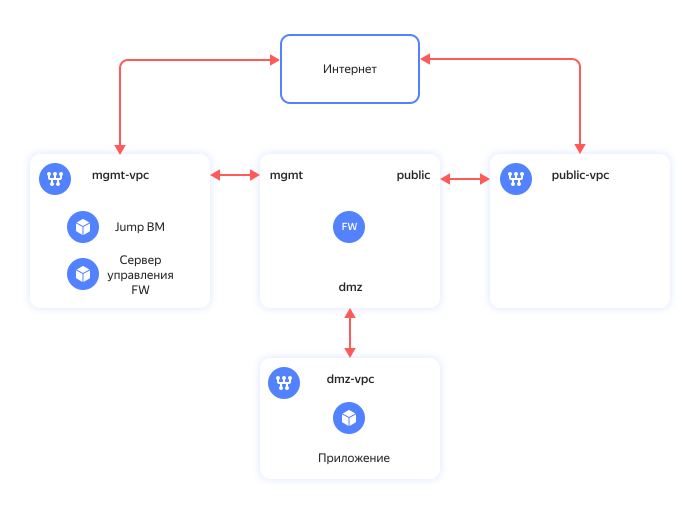

Comments to the chart:

| Element name | Description | Purpose |
| ----------- | ----------- | ----------- | 
| VPC: public-vpc | Public segment | Arranging public access from the Internet | 
| VPC: mgmt-vpc | MGMT segment | Managing the cloud infrastructure and hosting internal resources | 
| VPC: dmz-vpc | DMZ segment | Hosting frontends of apps available from the Internet | 
| FW | Check Point NGFW VM | Protecting the infrastructure and segmenting the network into security zones |
| MGMT, Public, DMZ | Check Point NGFW interfaces | Connecting each interface to the relevant VPC |
| Jump VM | VM with configured [WireGuard VPN](https://www.wireguard.com/) | Establishing a secure VPN connection to the control segment |
| FW management server | VM running the Check Point Security Management software | Managing your Check Point solution from a single management center |
| App | VM running a NGINX web server | Sample test app deployed in the DMZ segment |

</details>

### Next-Generation Firewall

[Yandex Cloud Marketplace](https://yandex.cloud/marketplace?categories=security) offers multiple options for NGFW. This scenario uses [Check Point CloudGuard IaaS](https://yandex.cloud/marketplace?publishers=f2evobrhpbdrcue7s9l5&tab=software). Its features include:
- Firewall, NAT, IPS, antivirus, and anti-bot protection services.
- Application-layer granular traffic control and session logging.
- Centralized security management with Check Point Security Management.

This example uses the basic access management and NAT policies for the Check Point solution.

Yandex Cloud Marketplace offers PAYG and BYOL licensing for Check Point CloudGuard IaaS. This example uses the BYOL option with a 15-day trial:
- NGFW VM: [Check Point CloudGuard IaaS: Firewall & Threat Prevention BYOL](https://yandex.cloud/marketplace/products/checkpoint/cloudguard-iaas-firewall-tp-byol-m).
- Management server VM: [Check Point CloudGuard IaaS: Security Management BYOL](https://yandex.cloud/marketplace/products/checkpoint/cloudguard-iaas-security-management-byol-m) for NGFW management.

We recommend the following options for production use:
- NGFW: [Check Point CloudGuard IaaS: Firewall & Threat Prevention PAYG](https://yandex.cloud/marketplace/products/checkpoint/cloudguard-iaas-firewall-tp-payg-m)
- Separate license for the `Check Point CloudGuard IaaS: Security Management` server. Alternatively, you can use your on-premise management server.

### Security groups

[Security groups](https://yandex.cloud/docs/vpc/concepts/security-groups) are intended to manage the traffic running across the resources in the same segment.

## Segments and resources to deploy

This solution creates resources for three segments in the cloud: 

| Segment | Description | Resources | Folders and networks | Security groups | 
| ----------- | ----------- | ----------- | ----------- | ----------- |
| public | Contains the Internet-facing resources. | | + | + |
| mgmt | Manages the cloud infrastructure. | Check Point NGFW, the Check Point management server, and the jump VM running WireGuard to connect from the Internet. | + | + |
| dmz | Hosts frontends for Internet-facing apps. | VM running a NGINX web server for our example. | + | + |

> **Important**
> 
> A cloud-based NGFW VM does not support adding new network interfaces after it is created. If you expect more segments in the future, you might want to deploy them in advance. You can specify additional segments in the `terraform.tfvars` file.

## Deploying the solution 

To deploy a secure network infrastructure based on Check Point Next-Generation Firewall:

1. [Prepare your cloud](#подготовьте-облако-к-работе)
1. [Prepare the environment](#подготовьте-окружение)
1. [Deploy your resources](#разверните-ресурсы)
1. [Configure the NGFW](#настройте-ngfw)
1. [Test the solution](#протестируйте-работоспособность-решения)

If you no longer need the resources you created, [delete them](#как-удалить-созданные-ресурсы).

> **Important**
> 
> Unless you configure your NGFW step by step, you will not be able to test your solution.

## Prepare your cloud

Sign up for Yandex Cloud and create a billing account:

1. Go to the [management console](https://console.yandex.cloud/) and log in to Yandex Cloud or create an account if you do not have one yet.
1. On the [Billing](https://console.yandex.cloud/billing) page, make sure you have a billing account linked and it has the `ACTIVE` or `TRIAL_ACTIVE` status. If you do not have a billing account yet, [create one](https://yandex.cloud/docs/billing/quickstart/).
If you have an active billing account, you can go to the [cloud page](https://console.yandex.cloud/cloud) to create or select a folder to run your infrastructure.
1. Check whether there is an account in the cloud with the `admin` permissions for the cloud.

### Required paid resources

The infrastructure support cost includes:

* Fee for continuously running VMs (see [Yandex Compute Cloud pricing](https://yandex.cloud/docs/compute/pricing)).
* Fee for using public IP addresses and outgoing traffic (see [Yandex Virtual Private Cloud pricing](https://yandex.cloud/docs/vpc/pricing)).

### Required quotas

Make sure your cloud has sufficient [quotas](https://yandex.cloud/docs/overview/concepts/quotas-limits) not being used by resources for other jobs.

<details>
<summary>Expand to view the reference information about the amount of resources created for this solution</summary>

| Resource | Amount |
| ----------- | ----------- |
| Folders | 3 |
| Virtual machines | 4 |
| VM vCPUs | 12 |
| VM RAM | 20 GB |
| Disks | 4 |
| SSD size | 240 GB |
| HDD size | 20 GB |
| Cloud networks | 3 |
| Subnets | 3 |
| Route tables | 2 |
| Security groups | 5 |
| Static public IP addresses | 2 |
| Static routes | 3 |

</details>

## Prepare the environment

The tutorial uses Windows software and the [Windows Subsystem for Linux](https://ru.wikipedia.org/wiki/Windows_Subsystem_for_Linux) (WSL).
The infrastructure is deployed using [Terraform](https://www.terraform.io/). 

1. If you have not installed WSL yet, [install](https://learn.microsoft.com/en-us/windows/wsl/install) one.
1. In addition, you can install a familiar Linux distribution, e.g., [Ubuntu](https://ubuntu.com/tutorials/install-ubuntu-on-wsl2-on-windows-11-with-gui-support#1-overview), on top of WSL.

> **Important**
> 
> All steps described below are completed in the Linux terminal.

1. [Install Git](https://github.com/git-guides/install-git).
1. [Install Terraform](https://yandex.cloud/docs/tutorials/infrastructure-management/terraform-quickstart#install-terraform).
1. [Install and configure the Yandex Cloud CLI](https://yandex.cloud/docs/cli/quickstart).

## Deploy your resources

1. Clone the `yandex-cloud-examples/yc-network-segmentation-with-checkpoint` GitHub repository and go to the `yc-network-segmentation-with-checkpoint` folder:
    
    ```bash
    git clone https://github.com/yandex-cloud-examples/yc-network-segmentation-with-checkpoint.git
    cd yc-network-segmentation-with-checkpoint
    ```

1. Set up the CLI profile to run operations under the service account (see [this guide](https://yandex.cloud/docs/tutorials/infrastructure-management/terraform-quickstart#get-credentials) for details).
    
1. Add the credentials to the environment variable:

    ```bash
    export YC_TOKEN=$(yc iam create-token)
    ```

1. Get your PC's public IP address:
      
      ```bash
      curl ifconfig.io
      ```

1. Put your custom values for variables in the `terraform.tfvars` file. It contains sample values, but you can replace them with your own data (cloud ID, segment names, and IP addresses of subnets, app port in DMZ, and the jump VM connection properties). Make sure to specify your cloud ID (`cloud_id`) and the list of public IPs and subnets (`trusted_ip_for_access_jump-vm`) trusted to access the jump VM. Open the `terraform.tfvars` file and edit the following:

   1. The line with the cloud ID:
      
      ```text
      cloud_id = "<cloud_ID>"
      ```

   1. The line with a list of allowed public IP addresses for `jump-vm` access:
      
      ```text
      trusted_ip_for_access_jump-vm = ["<PC_external_IP>/32"]
      ```

    > **Important**
    > 
    > We recommend specifying additional segments in advance if you may need them later on, since a cloud-based NGFW VM does not support adding new network interfaces after it is created. 

    <details>
    <summary>Expand to view the description of variables in `terraform.tfvars`</summary>

    | Parameter<br>name | Needs<br>editing | Description | Type | Example |
    | ----------- | ----------- | ----------- | ----------- | ----------- |
    | `cloud_id` | Yes | ID of your cloud in Yandex Cloud | `string` | `b1g8dn6s3v2eiid9dbci` |
    | `az_name` | - | Yandex Cloud <a href="https://yandex.cloud/docs/overview/concepts/geo-scope">availability zone</a> to host your resources. | `string` | `ru-central1-d` |
    | `security_segment_names` | - | List of segment names. The first segment is for the management resources, the second, for the resources with public internet access, the third, for the DMZ. If you need more segments, add them at the end of the list. When adding a segment, make sure to specify the subnet prefix in `subnet_prefix_list`. | `list(string)` |  `["mgmt", "public", "dmz"]` |
    | `subnet_prefix_list` | - | List of subnet prefixes as indicated in the `security_segment_names` list. Specify one prefix for each segment. | `list(string)` | `["192.168.1.0/24", "172.16.1.0/24", "10.160.1.0/24"]` |
    | `public_app_port` | - | TCP port for a DMZ application open for internet connection. | `number` | `80` |
    | `internal_app_port` | - | Internal TCP port of a DMZ application to which the NGFW will direct traffic. You may specify the same port as `public_app_port` or a different one. | `number` | `8080` |
    | `trusted_ip_for_access_jump-vm` | Yes | List of public IPs or subnets trusted to access the jump VM. Used in the incoming rule of the jump VM security group. | `list(string)` | `["A.A.A.A/32", "B.B.B.0/24"]` |
    | `jump_vm_admin_username` | - | Username for connecting to jump VM over SSH. | `string` | `admin` |
    | `wg_port` | - | UDP port for inbound traffic as indicated in the Jump VM WireGuard settings. | `number` | `51820` |

    </details>


1. Deploy the resources in the cloud using Terraform:

   1. Initialize Terraform:
       
       ```bash
       terraform init
       ```

   1. Check that your Terraform files are properly configured:
       
       ```bash
       terraform validate
       ```

   1. Check the list of cloud resources you are about to create:
       
       ```bash
       terraform plan
       ```

   1. Create resources:
       
       ```bash
       terraform apply
       ```
1. After the `terraform apply` process is over, the command line will output a list of information on the deployed resources. Later on, you can view this information by running the `terraform output` command:

    <details>
    <summary>Expand to view the information on deployed resources</summary>

    | Parameter | Description | Sample value |
    | ----------- | ----------- | ----------- |
    | `dmz-web-server_ip_address` | DMZ web server IP address for publishing a test application from the DMZ segment. Used for configuring destination NAT on a firewall. | `10.160.1.100` |
    | `fw-mgmt-server_ip_address` | Firewall management server IP address. | `192.168.1.100` |
    | `fw_gaia_portal_mgmt-server_password` | Default password for the initial connection to the firewall management server IP address over HTTPS. | `admin` |
    | `fw_mgmt_ip_address` | Firewall IP address in the management network. | `192.168.1.10` |
    | `fw_public_ip_address` | Public firewall IP address. | `D.D.D.D` |
    | `fw_sic-password` | One-time password (SIC) for adding a firewall to the firewall management server. | The `terraform output` command does not return this variable. To view its value, run `terraform output fw_sic-password`. |
    | `fw_smartconsole_mgmt-server_password` | Password for connecting to the firewall management server through the Check Point SmartConsole GUI. | The `terraform output` command does not return this variable. To view its value, run `terraform output fw_smartconsole_mgmt-server_password`. |
    | `jump-vm_path_for_WireGuard_client_config` | Configuration file for enabling a secure WireGuard VPN connection to the jump VM. | `./jump-vm-wg.conf` |
    | `jump-vm_public_ip_address_jump-vm` | Jump VM public IP | `E.E.E.E` |
    | `path_for_private_ssh_key` | File with a private key used to connect to VMs over SSH (jump VM, firewalls, management server, and DMZ web server) | `./pt_key.pem` |
    
    </details>

## Configure the NGFW

Configure the FW to meet your specific needs in line with the corporate security policy. To manage and set up the Check Point solution, employ the SmartConsole GUI client for Windows. 

This example describes how to configure firewalls with basic access management and NAT policies required for performance testing but insufficient for production deployment.

This scenario tells you how to configure your NGFW through the following steps in SmartConsole:
- Adding a firewall.
- Configuring the FW network interfaces.
- Creating network objects. 
- Configuring the access management policy.
- Configuring the NAT policy.
- Applying the security policies.

Learn more about Check Point features and configuration with our free course, [Deep Dive into Network Security](https://yandex.cloud/training/network-security).

### Connect to the control segment via a VPN

After deploying the infrastructure, the `mgmt` folder will contain a VM named `jump-vm` based on an Ubuntu image with the [WireGuard VPN](https://www.wireguard.com/) configured for a secure connection. Set up a VPN tunnel to `jump-vm` on your PC to access the `mgmt`, `dmz`, and `public` segment subnets.  

To set up the VPN tunnel:

1. Get the username in the Linux subsystem:

   ```bash
   whoami
   ```

1. [Install](https://download.wireguard.com/windows-client/wireguard-installer.exe) WireGuard on your PC.
1. Open WireGuard and click **Add Tunnel**.
1. In the dialog box that opens, select the `jump-vm-wg.conf` file in the `yc-network-segmentation-with-checkpoint` folder.
   To find the directory created in a Linux subsystem, e.g., Ubuntu, type the file path in the dialog box address bar:

   ```bash
   \\wsl$\Ubuntu\home\<Ubuntu_user_name>\yc-network-segmentation-with-checkpoint
   ```
   
   Where `<Ubuntu_user_name>` is the name of the current Linux distribution user.

1. Click **Activate** to activate the tunnel.
1. Check network connectivity with the management server via the WireGuard VPN tunnel by running the following command in the terminal:
   
   ```bash
   ping 192.168.1.100
   ```

   > **Important**
   > 
   > If the packets fail to reach the management server, make sure that the `mgmt-jump-vm-sg` [security group](https://yandex.cloud/docs/vpc/concepts/security-groups) rules for incoming traffic have your PC's public IP address specified.


### Run the SmartConsole management console

To manage and set up the Check Point solution, install and run the SmartConsole GUI client: 

1. Connect to the NGFW management server by opening `https://192.168.1.100` in your browser. 
1. Sign in using `admin` as both username and password. 
1. In the Gaia Portal interface that opens, download the SmartConsole GUI client. To do this, click **Manage Software Blades using SmartConsole. Download Now!**.
1. Install SmartConsole on your PC.
1. Get the SmartConsole access password:
   
    ```bash
    terraform output fw_smartconsole_mgmt-server_password
    ```

1. Open SmartConsole and sign in with the `admin` username, `192.168.1.100` management server IP address, and SmartConsole password.

### Add a firewall

Add the firewall to the management server using the wizard:

1. In the **Objects** drop-down list at the top left, select **More object types → Network Object → Gateways and Servers → New Gateway...**.
1. Click **Wizard Mode**.
1. In the dialog box that opens, enter the following:
   * **Gateway name:** `FW`
   * **Gateway platform:** `CloudGuard IaaS`
   * **IPv4:** `192.168.1.10`
1. Click **Next**.
1. Get the FW access password:
   
    ```bash
    terraform output fw_sic-password
    ```

1. In the **One-time password** field, type the previously obtained password.
1. Click **Next**, and then **Finish**.

### Configure the FW gateway network interfaces

Configure the `eth0` network interface:

1. In the **Gateways & Servers** tab, open the FW setup dialog. To do this, double-click the added FW in the list.
1. In the **Topology** table within the **Network Management** tab, select the `eth0` interface, click **Edit**, and then click **Modify...** in the window that opens.
1. Under **Security Zone**, activate **Specify Security Zone** and select **InternalZone**.

In the same way, configure the `eth1` and `eth2` network interfaces:

1. For the `eth1` interface, specify **ExternalZone** under **Security Zone**.
1. For the `eth2` interface, in the **Leads To** section, select **Override** and enable **Interface leads to DMZ**. Under **Security Zone**, set **DMZZone**.

| Interface | IPv4 address/mask | Leads To | Security Zone | Anti Spoofing |
| ----------- | ----------- | ----------- | ----------- | ----------- |
| eth0 | 192.168.1.10/24 | This network (Internal) | InternalZone | Prevent and Log |
| eth1 | 172.16.1.10/24 | Internet (External) | ExternalZone | Prevent and Log |
| eth2 | 10.160.1.10/24 | This network, DMZ (Internal) | DMZZone | Prevent and Log |

<details>
<summary>Configuring FW interfaces</summary>

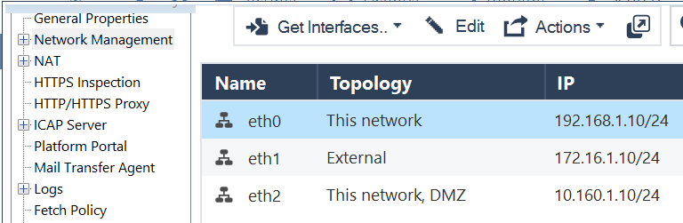

<details>
<summary>Configuring FW _mgmt_ interface</summary>

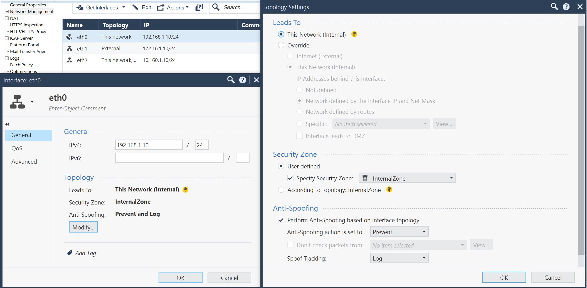

</details>

<details>
<summary>Configuring FW _public_ interface</summary>

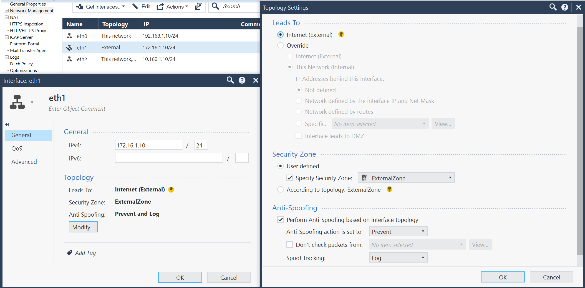

</details>

<details>
<summary>Configuring FW _dmz_ interface</summary>

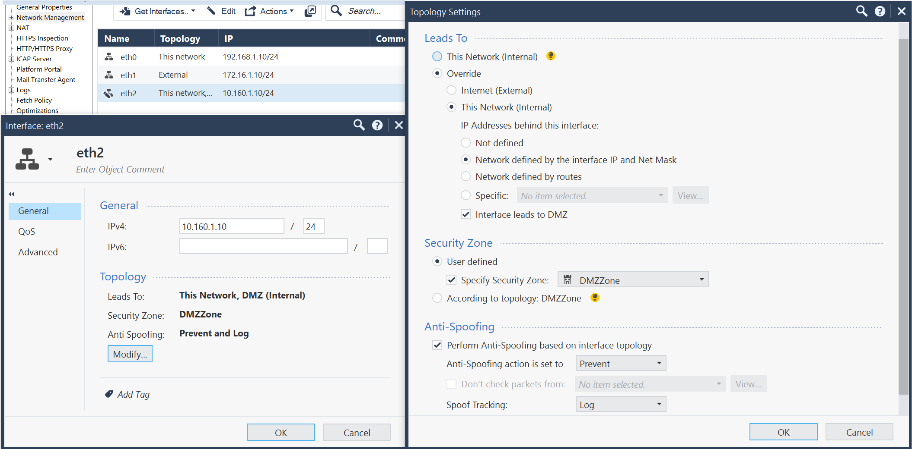

</details>
</details> 


### Create network objects

1. In the **Objects** drop-down list at the top left, select **New Network...** to create networks with the following data:

    | Name | Network address | Net mask |
    | ----------- | ----------- | ----------- |
    | mgmt | 192.168.1.0 | 255.255.255.0 |
    | public | 172.16.1.0 | 255.255.255.0 |
    | dmz | 10.160.1.0 | 255.255.255.0 |

    <details>
    <summary>Sample screenshot for _public_</summary>

    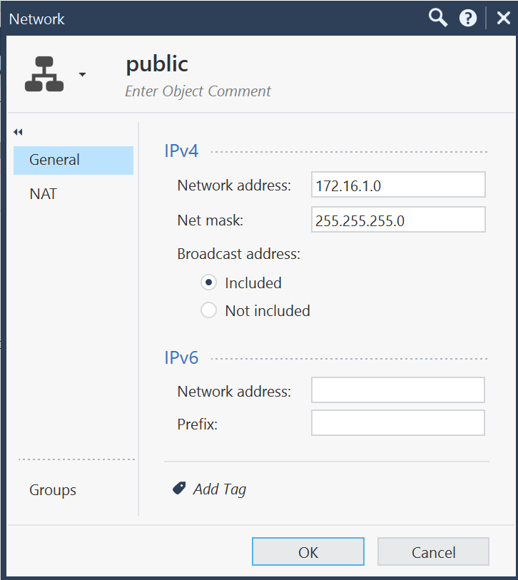

    </details>

    For the DMZ network, set up **Automatic Hide NAT** to hide the addresses of internet-facing VMs hosted in the DMZ segment behind the IP address of the FW gateway in the public segment. To do this:
      1. In the `dmz` network editing dialog box, go to the **NAT** tab.
      1. Activate **Add automatic address translation rules**, select **Hide** from the drop-down list, and enable **Hide behind the gateway**.

    <details>
    <summary>Setting up the NAT configuration for a DMZ network</summary>

    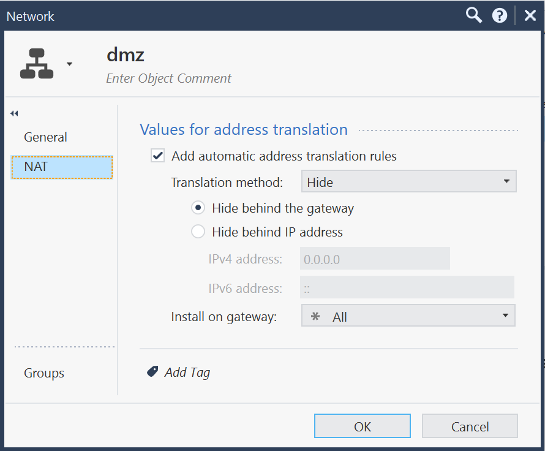

    </details>

1. In the **Objects** drop-down list at the top left, select **New Host...** and create hosts with the following data:

    | Name | IPv4 address |
    | ----------- | ----------- |
    | dmz-web-server | 10.160.1.100 |
    | FW-public-IP | 172.16.1.10 |

    <details>
    <summary>Sample screenshot for _dmz-web-server_</summary>

    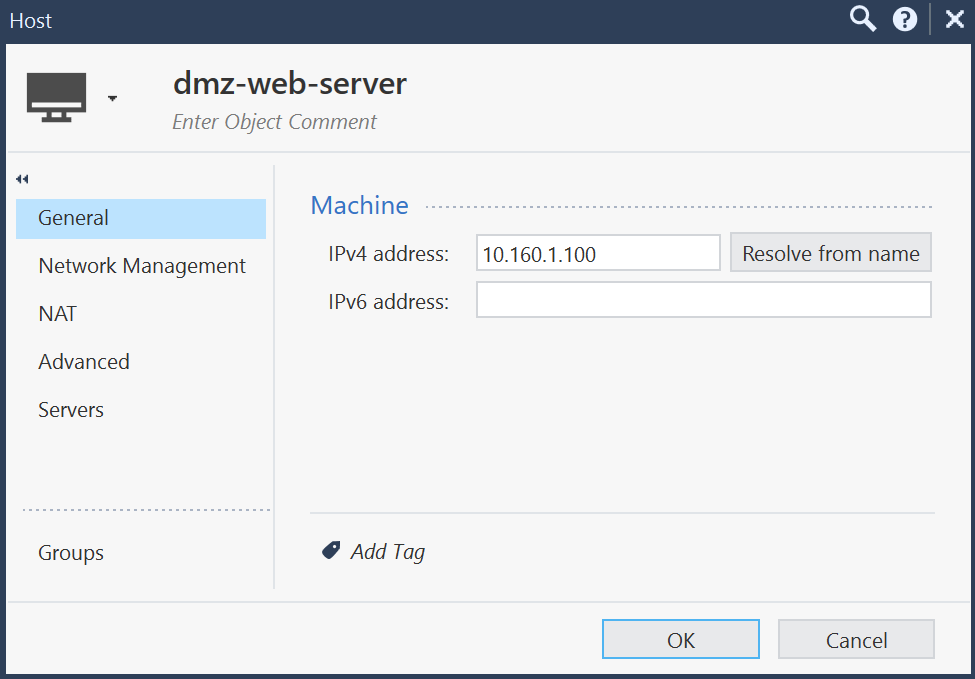

    </details>

1. Select **More object types → Network Object → Service → New TCP...** to create a TCP service for the application deployed in the DMZ segment and specify `TCP_8080` as its name and `8080` as the port.

    <details>
    <summary>TCP Service screenshot</summary>

    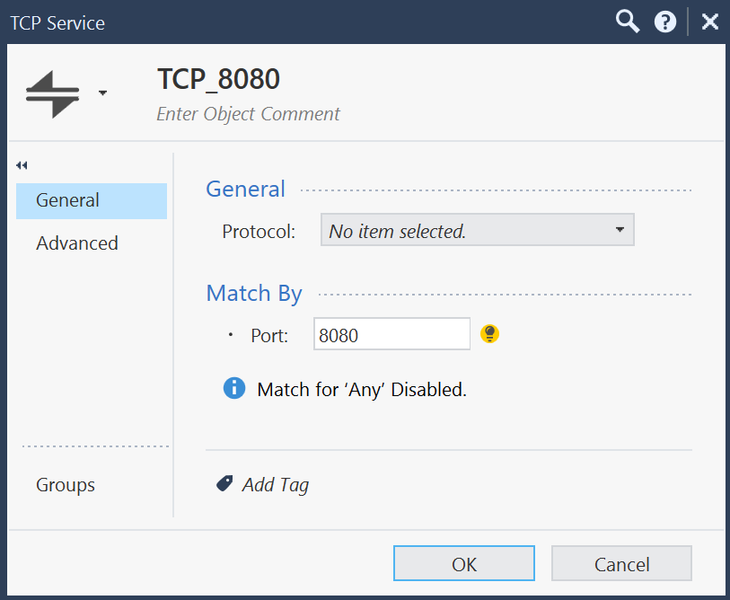

    </details>

### Set security policy rules

To add a security rule:

1. In the **Security policies** tab, select **Policy** under **Access Control**.
1. In the rule table, right-click next to the **New Rule** option in the context menu and select **Above** or **Below**.
1. In a new line:
   * In the **Name** column, enter `Web-server port forwarding on FW`.
   * In the **Destination** column, select the `FW-public-IP` object.
   * In the **Services & Applications** column, select the `http` object.
   * In the **Action** column, select `Accept`.
   * In the **Track** column, select `Log`.

In the same way, add the other basic rules from the table below to test the firewall policies, run NLB health checks, publish a test application from the DMZ segment, and test its fault tolerance.

| Number | Name | Source | Destination | VPN | Services & Applications | Action | Track | Install On |
| ----------- | ----------- | ----------- | ----------- | ----------- | ----------- | ----------- | ----------- | ----------- |
| 1 | Web-server port forwarding on FW | Any | FW-public-IP | Any | http | Accept | Log | Policy Targets (All gateways) |
| 2 | FW management | mgmt | FW, mgmt-server | Any | https, ssh | Accept | Log | Policy Targets (All gateways)  |
| 3 | Stealth | Any | FW, mgmt-server | Any | Any | Drop | Log | Policy Targets (All gateways) |
| 4 | mgmt to DMZ | mgmt | dmz | Any | Any | Accept | Log | Policy Targets (All gateways) |
| 5 | mgmt to public | mgmt | public | Any | Any | Accept | Log | Policy Targets (All gateways) |
| 6 | ping from dmz to internet | dmz | ExternalZone | Any | icmp-reguests (Group) | Accept | Log | Policy Targets (All gateways) |
| 7 | Cleanup rule | Any | Any | Any | Any | Drop | Log | Policy Targets (All gateways) |

<details>
<summary>Description the access management policy rules</summary>

| Number | Name | Description |
| ----------- | ----------- | ----------- |
| 1 | Web-server port forwarding on FW | Allows access to the IP address of your _public_ segment firewall on TCP port 80. | 
| 2 | FW management | Allows access to firewalls and the firewall management server from the MGMT segment for management tasks. |
| 3 | Stealth | Denies access to firewalls and the firewall management server from other segments. |
| 4 | mgmt to DMZ | Allows access from the MGMT segment to DMZ for management tasks. |
| 5 | mgmt to public | Allows access from MGMT to the public segment for management tasks. |
| 6 | ping from dmz to internet | Allows outbound ICMP packets from the DMZ segment to the Internet for performance testing. |
| 7 | Cleanup rule | Denies access to other traffic. |

</details>

<details>
<summary>Access management policy screenshot</summary>

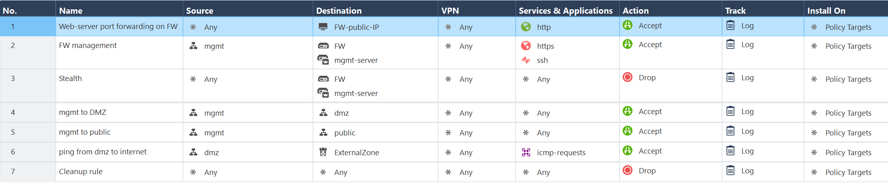

</details>

### Set up a static NAT table

The destination NAT routes user requests to the application's web server in the DMZ segment.

It will translate the destination IP address to the web server IP and the destination port to TCP port 8080 in the headers of packets with user requests sent to a DMZ application.

To set up the NAT tables of the FW gateway:

1. Go to the **NAT** subsection of the **Access Control** section.
1. In the rule table menu, select **Add rule on top**.
1. In a new line:
   * In the **Original Destination** column, select the `FW-public-IP` object.
   * In the **Original Services** column, select the `http` object.
   * In the **Translated Destination** column, select the `dmz-web-server` object.
   * In the **Translated Services** column, select the `TCP_8080` object.

   The NAT table will display this rule:

   | Number | Original Source | Original Destination | Original Services | Translated Source | Translated Destination | Translated Services | Install On |
   | ----------- | ----------- | ----------- | ----------- | ----------- | ----------- | ----------- | ----------- | 
   | 1 | Any | FW-public-IP | http | Original | dmz-web-server | TCP_8080 | Policy Targets (All gateways) |

   <details>
   <summary>Access management policy for NAT</summary>

   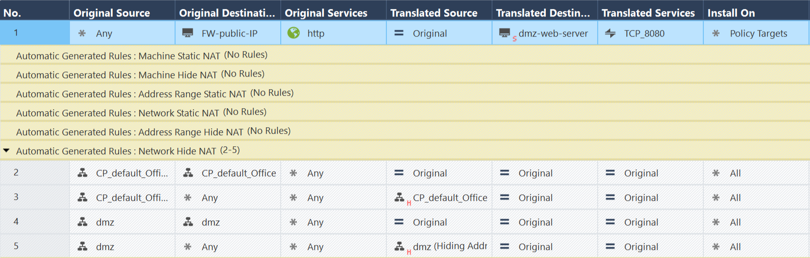

   </details>

###  Apply the security policies

1. Click **Install Policy** at the top left of the screen.
1. In the dialog box that opens, click **Publish & Install**.
1. In the next dialog, click **Install** and wait for the process to complete.

<details>
<summary>Install policy screenshot</summary>

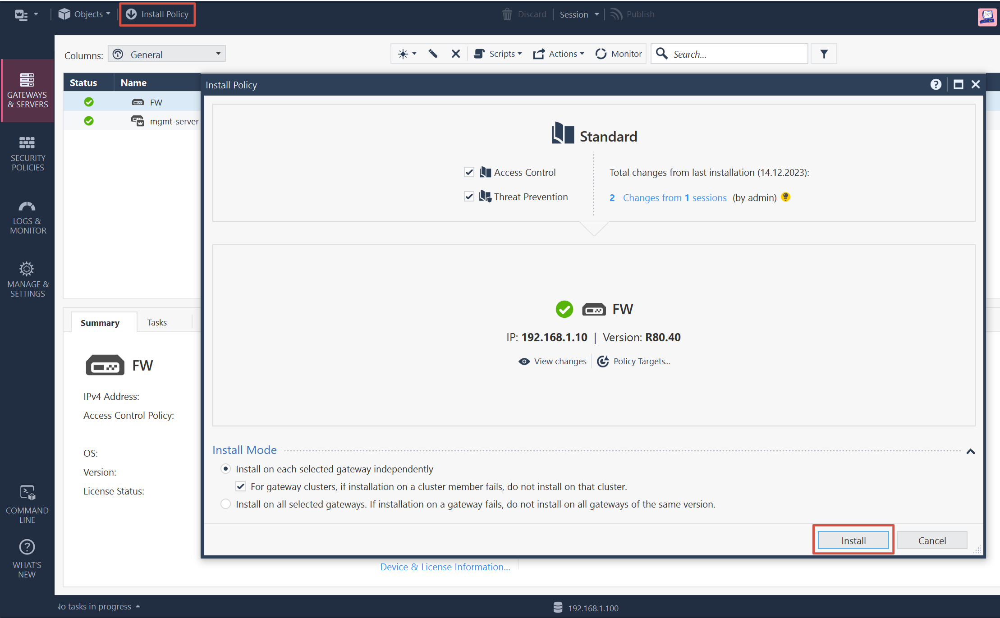

</details> 


## Test the solution

1. To find out the public IP address of the firewall, run the following command in the terminal:

    ```bash
    terraform output fw_public_ip_address
    ```

1. Make sure the network infrastructure can be accessed from the outside by opening the following address in the browser:
    
    ```bash
    http://<FW_public_IP_address>
    ```
    If the system is accessible from the outside, you will see the `Welcome to nginx!` page.

1. Make sure the firewall security policy rules that allow traffic are active. To do this, go to your PC’s `yc-network-segmentation-with-checkpoint` directory and connect to the DMZ VM over SSH:
   
    ```bash
    cd ~/yc-network-segmentation-with-checkpoint
    ssh -i pt_key.pem admin@<internal_IP_address_of_VM_in_DMZ_segment>
    ```

1. To check that there is access from the VM in the DMZ segment to a public resource on the Internet, run this command:    
   
    ```bash
    ping ya.ru
    ```
    
    The command must run according to the `ping from dmz to internet` rule that allows traffic.

1. Make sure the security policy rules that prohibit traffic are applied.
   To check that `Jump VM` in the `mgmt` segment cannot be accessed from the `dmz` segment, run this command: 

   ```bash
   ping 192.168.1.101
   ```
   This command must fail according to the `Cleanup rule` that prohibits traffic.

1. In SmartConsole, open the `LOGS & MONITOR` section. In the `Logs` tab, find the entries made during testing to see which security rules and actions were applied to the traffic.

    <details>
    <summary>Rule log screenshot: _Web-server port forwarding on FW_</summary>

    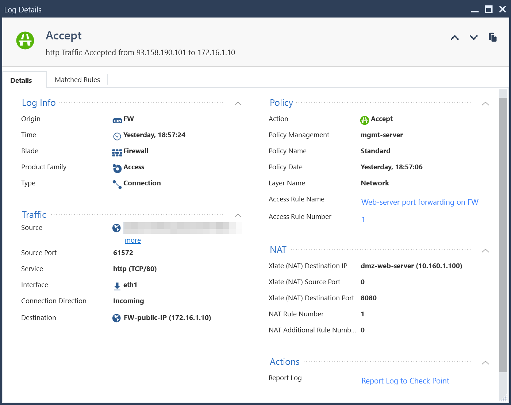

    </details> 
    
    <details>
    <summary>Rule log screenshot: _ping from dmz to internet_</summary>

    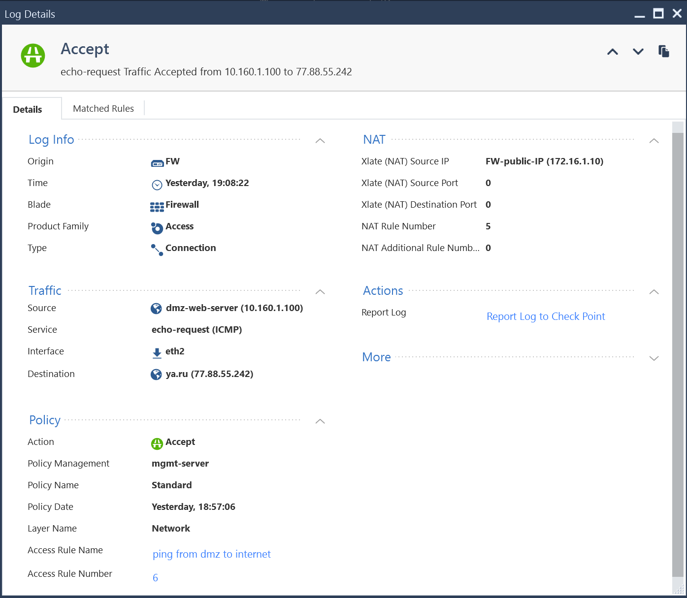

    </details> 

    <details>
    <summary>Rule log screenshot: _Cleanup rule_</summary>

    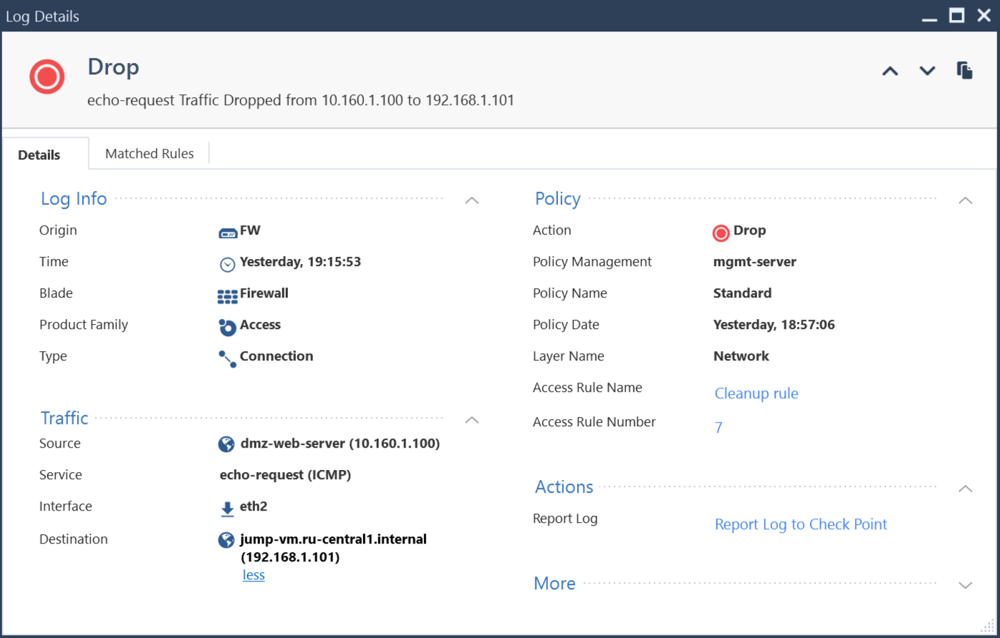

    </details>


## Requirements for production deployment.

- If you need to ensure NGFW fault tolerance and high availability of the deployed applications, use [this recommended solution](https://yandex.cloud/docs/tutorials/routing/high-accessible-dmz).
- Make sure to change the passwords sent in the `check-init...yaml` files via the metadata service:
    - SIC password for connecting the firewall and the firewall management server.
    - Check Point SmartConsole password.
    - Admin user password for the firewall management server. You can change this password in Gaia Portal.
- Save the `pt_key.pem` private SSH key to a secure location or recreate it separately from Terraform.
- Delete the public IP address of the jump VM if you do not need it anymore.
- If you plan to use it for connecting to the management segment with WireGuard VPN, change the WireGuard keys both in jump VM and admin workstation.
- Set up access control and NAT policies for your installation in the Check Point NGFW.
- In the security groups within segments, set up the required rules for deployed applications.
- Do not assign public IP addresses to the VMs in those segments where the Check Point NGFW routing tables are used. The only exception is the MGMT segment where route tables do not use the `0.0.0.0/0` default route. 
- Select your preferred Check Point CloudGuard IaaS license and image (see [Next-Generation Firewall](#next-generation-firewall)).

## How to delete the resources you created

To stop paying for the resources you created, run this command:

  ```bash
  terraform destroy
  ```
  Terraform will **permanently** delete all resources: networks, subnets, VMs, folders, etc.

Since the resources you created reside in folders, a faster way to delete them all is to delete all folders using the YandexCloud console and then, the `terraform.tfstate` file from the `yc-network-segmentation-with-checkpoint` folder on your PC.
